# 專案結構與技術說明

本專案為 Flask + SQLAlchemy 的 Web 應用，採用 Jinja2 模板與 session 認證機制，內建登入/登出記錄與閒置登出控制（滑動續期）。提供使用者註冊/登入、玩家與隊伍管理、戰績展示與基本 UI 介面。

最後更新日期：2025/10/20

## 目錄與檔案結構

- app.py
  - Flask 應用主程式
  - 環境變數載入、設定管理
  - SQLAlchemy ORM 模型（users、login_log、logout_log 及玩家/隊伍相關模型）
  - 密碼雜湊與二次驗證碼（second code）雜湊邏輯（HMAC + SHA-256 + Base64）
  - Session 與閒置過期控制（滑動續期）
  - 共用工具（IP 解析、輸入檢核、代碼驗證）
  - 路由與視圖（登入、登出、首頁 index、玩家頁面、隊伍建立流程等）
- requirements.txt
  - 依賴套件清單（Flask、Flask‑SQLAlchemy、passlib[argon2] 等）
- templates/
  - index.html：首頁資訊區塊（帳號、線上人數、玩家資料摘要、戰績顯示等）
  - 玩家頁面（players.html 等）
  - 隊伍建立/管理頁面（create_team.html 等）
  - 登入/註冊頁面
- static/
  - CSS/JS/圖片等前端資源
- .env.sample
  - 環境變數示例（資料庫、密鑰、session 設定等）
- README.md
  - 本文件

---

## 技術棧與依賴

- 後端
  - Python 3.9+（建議）
  - Flask
  - Flask-SQLAlchemy（整合 SQLAlchemy ORM）
  - passlib[argon2]（密碼雜湊，使用 Argon2）
- 前端
  - Jinja2 模板引擎
  - 自訂 CSS
- 標準庫
  - datetime、os、re、secrets、hmac、hashlib、base64、functools 等
- 認證與會話
  - 伺服器端 Session 與簽章 Cookie
  - 閒置登出控制（滑動續期）

---

## 設定與環境變數

- 使用 python-dotenv（容錯載入）支援 .env
- 必填環境變數（缺少會直接拋出錯誤）
  - DATABASE_URL 或分項 MYSQL_HOST / MYSQL_PORT / MYSQL_USER / MYSQL_PASSWORD / MYSQL_DB
  - SECRET_KEY：Flask 簽章用密鑰
  - SECOND_CODE_SECRET：HMAC 驗證 second code 的金鑰
  - SESSION_LIFETIME_MINUTES：Session 存活分鐘數
  - SESSION_SLIDING_RENEWAL：是否啟用滑動續期（true/false）
- SQLAlchemy 連線字串由上述參數組裝：
  - mysql+pymysql://{user}:{password}@{host}:{port}/{db}
- Flask 設定
  - JSON_AS_ASCII=False
  - SQLALCHEMY_DATABASE_URI、SQLALCHEMY_TRACK_MODIFICATIONS=False
  - PERMANENT_SESSION_LIFETIME=10 分鐘（滑動過期）

---

## 資料模型與關聯

- User（users）
  - 欄位：id, account(unique, index), password_hash, second_code_hash, register_ip, register_at
  - 關聯：User 1—N LoginLog（cascade="all, delete-orphan"）

- LoginLog（login_log）
  - 欄位：id, user_id(FK→users.id, CASCADE), ip, success(Boolean), user_agent, created_at

- LogoutLog（logout_log）
  - 欄位：id, user_id(FK→users.id, CASCADE), ip, reason(Enum: manual/idle_timeout/forced/session_invalid/other, 預設 manual), user_agent, created_at

- PlayerProfile（player_profile）
  - 主鍵與關聯：
    - id（PK）
    - user_id（FK→users.id, UNIQUE, ON DELETE/UPDATE CASCADE）
  - 基本資訊：
    - player_name varchar(32) NOT NULL
    - team_name varchar(32) NOT NULL（唯一索引 uq_team_name）
    - arena_name varchar(32) NOT NULL
    - fanpage_name varchar(32) NOT NULL
    - 備註：應用層建議限制上述名稱最長 8 字，資料庫層為 32
  - 隊伍初始與進度欄位（皆為 UNSIGNED INT，NOT NULL，具預設值 0）：
    - team_money（球隊資金）
    - team_player_count（球隊人數）
    - arena_seat_count（場館座位數）
    - fanclub_staff_count（粉絲團員工）
    - fanclub_member_count（粉絲團人數）
    - scouting_chances_left（球探可用次數）
  - 戰績欄位（皆為 UNSIGNED INT，NOT NULL，預設 0）：
    - league_results_win，league_results_lose
    - rookie_league_results_win，rookie_league_results_lose
  - 追蹤欄位：
    - created_at datetime NOT NULL DEFAULT CURRENT_TIMESTAMP
    - updated_at datetime NOT NULL DEFAULT CURRENT_TIMESTAMP ON UPDATE CURRENT_TIMESTAMP
    - created_ip varchar(64) NULL
    - user_agent varchar(256) NULL
  - 索引：
    - PRIMARY KEY (id)
    - UNIQUE KEY uq_player_user (user_id)
    - UNIQUE KEY uq_team_name (team_name)

說明：
- 以上為 2025/10/20 的 DDL 同步狀態；若 ORM 使用 SQLAlchemy，請確保模型欄位型別、索引與 unique 條件對齊，並在遷移工具（如 Alembic）產出對應 migration。
- 名稱長度限制：資料庫允許 32；應用層建議限制 8 字以維持版面呈現。

---

## 認證與安全機制

- 密碼雜湊：passlib 的 argon2（argon2.hash / argon2.verify）
- Second code 雜湊：HMAC-SHA256(APP_SALT) 後再做 base64 編碼
  - hash_code(plain) / verify_code(plain, hashed)
- 6 碼驗證碼：使用 secrets 產生 0–9 的亂數組成
- Session 安全：
  - SECRET_KEY 來自環境變數
  - PERMANENT_SESSION_LIFETIME=10 分鐘
  - 採滑動過期：每次有效操作會刷新 last_seen，以延續會話
  - 閒置逾時登出時記錄 logout_log，reason=idle_timeout
- IP 與 UA 記錄：
  - 以 X-Forwarded-For 解析客戶端 IP（有逗號取第一段），否則用 request.remote_addr
  - user_agent 存入 log

## 請求流程與中介邏輯（概要）

- 載入環境 → 初始化 Flask 與 SQLAlchemy → 定義模型與工具 → 設定 session 與逾時策略 → 定義路由
- 路由通常會：
  - 檢查 session 狀態與 last_seen 超時
  - 執行商務邏輯（登入、登出、註冊、頁面渲染）
  - 視需要寫入 LoginLog / LogoutLog
  - 回傳模板（render_template）或 JSON（API 類）

## 路由與流程圖

### 登入流程

  

### Players 頁流程

  

### 登出流程

  

### 閒置逾時檢查

  

## 主要功能

- 使用者與認證
  - 註冊、登入、登出
  - 密碼雜湊（Argon2，透過 passlib）
  - 二次驗證碼（second code）：HMAC + SHA-256 + Base64 安全雜湊與驗證
  - 登入/登出記錄（login_log、logout_log）
  - 閒置登出控制（滑動續期）：使用者活躍時自動延長 session，避免天真時間造成誤差

- 玩家與隊伍管理
  - 玩家資料摘要（PlayerProfile）
  - 創建隊伍流程（導引式建立，支援預設值）
    - 預設值設定說明見文末更新摘要

- 戰績展示
  - 支援顯示聯盟戰績、新人聯盟戰績等
  - 若勝敗合計為 0，顯示「尚未開始比賽」
  - 否則顯示「X 勝 Y 敗（勝率 Z%）」；勝率以小數一位顯示

- UI/UX
  - 起始頁面（index）資訊呈現：帳號、線上人數、玩家資料摘要等
  - 玩家頁面：欄位與版面對齊、統一資料來源

---

## 模板與頁面設計

- 基底模板 base.html 管理共用結構（導覽列、meta、favicon、CSS/JS）
- 個別功能頁透過 Jinja2 block 擴充
- 圖片、favicon 等一律使用 url_for('static', ...) 產生路徑，避免硬編路徑

## 日誌表運作規則

- login_log
  - 成功或失敗登入都記錄 success(Boolean)、ip、user_agent、created_at
- logout_log
  - 登出類型以 reason 區分：manual / idle_timeout / forced / session_invalid / other
  - 皆記錄 ip、user_agent、created_at

## 技術要點清單

- Flask（路由、session、模板渲染）
- Jinja2（模板與繼承）
- SQLAlchemy（ORM、關聯、外鍵、Enum）
- PyMySQL（MySQL 連線驅動）
- passlib[argon2]（安全密碼雜湊）
- HMAC-SHA256 + base64（second code 驗證碼雜湊）
- dotenv（可選；本地開發載入 .env）
- 安全實務：
  - 不在程式中硬編密鑰或資料庫帳密
  - 所有敏感值從環境變數載入與驗證
  - 會話滑動過期、閒置登出記錄
  - 以外鍵約束和 CASCADE 保持資料一致性

## 與資料庫操作相關的注意事項

- 若需清空 login_log / logout_log
  - TRUNCATE 快且會重置 AUTO_INCREMENT，但需先停用外鍵檢查或臨時移除外鍵
  - DELETE 可回滾，但大量資料較慢，需手動 ALTER TABLE … AUTO_INCREMENT=1
- 因模型已設 ON DELETE CASCADE，刪除 users 會自動清除相關 log

---

## 變更日誌

- 先前版本
  - 基礎認證（註冊/登入/登出）、Argon2 密碼雜湊、second code HMAC 驗證
  - 登入/登出記錄與閒置登出控制（滑動續期）
  - 初版玩家/隊伍功能與戰績展示

- 2025/10/20
  - feat: 完整化創建隊伍流程並設定預設值（資金 100 萬、人數 0、座位 2000、粉專員工 0、粉絲 0、球探次數 100）
  - feat: 起始頁面（index）資訊呈現優化
  - feat: 玩家頁面顯示與欄位統一與對齊
  - style: 全站配色更新為新主題
  - docs: README 更新（本次將更新內容集中至文末）

---

## 更新摘要（2025/10/20）

- 完善「創建隊伍」流程
  - 預設值：
    - 球隊資金：100 萬
    - 球隊人數：0
    - 場館座位數：2000
    - 粉絲團員工：0
    - 粉絲團人數：0
    - 球探可用次數：100
- UI/UX
  - 改變網站配色（新主題）
  - 起始頁面改善：資訊呈現更清晰、加入登入狀態與玩家摘要
  - 玩家頁面改善：欄位與版面對齊、統一資料來源（以 PlayerProfile 為主）